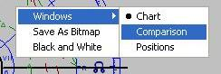
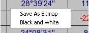

# Morinus SE — Software libre de astrología tradicional | Free Traditional Astrology Software

[](LICENSE.txt)
[](https://www.python.org/)
[](https://wxpython.org/)

**Morinus SE** es un programa libre de **astrología tradicional** basado en Morinus de Robert Nagy y en la [Special Edition de Elías D. Molins](https://www.campus-astrologia.es/morinus-special-edition) (Campus Astrología), con efemérides suizas de alta precisión (Swiss Ephemeris). Calcula cartas natales, **direcciones primarias** (Placidus, Regiomontanus, Campanus), **profecciones / atacires**, **firdaria**, revoluciones solares y lunares, tránsitos, direcciones secundarias, sinastría, estrellas fijas, partes arábigas, antiscia y dodecatemoria. Disponible en **6 idiomas** (español, inglés, húngaro, italiano, francés y ruso).

**Morinus SE** is a free **traditional astrology** program based on Robert Nagy's Morinus and on [Elías D. Molins' Special Edition](https://www.campus-astrologia.es/morinus-special-edition) (Campus Astrología), powered by high-precision Swiss Ephemeris. It computes natal charts, **primary directions** (Placidus, Regiomontanus, Campanus), **profections**, **firdaria**, solar and lunar returns, transits, secondary directions, synastry, fixed stars, arabic parts, antiscia and dodecatemoria. Available in **6 languages** (English, Spanish, Hungarian, Italian, French, Russian).

> Palabras clave / Keywords: astrología tradicional, traditional astrology, direcciones primarias, primary directions, profecciones, profections, atacires, firdaria, revolución solar, solar return, tránsitos, transits, sinastría, synastry, Swiss Ephemeris, software astrología libre, free astrology software, Morinus.

## Descarga / Download

- **Linux (recomendado):** [Morinus_SE-8.0.0-x86_64.AppImage](https://github.com/IngenieriaAstrologica/Morinus/releases/download/v8.0.0-se/Morinus_SE-8.0.0-x86_64.AppImage) — sin instalación: `chmod +x *.AppImage && ./Morinus_SE-8.0.0-x86_64.AppImage`.
- [Todas las versiones / All releases](https://github.com/IngenieriaAstrologica/Morinus/releases).
- **Windows:** ejecutar desde el código fuente con Python 3.11+ (ver Instalación).

## Capturas / Screenshots




## Características / Features

### Carta natal, horaria, electiva y mundana / Natal, horary, electional and mundane charts

Cartas natales con domificación Placidus, Regiomontanus, Campanus y más sistemas, además de horaria, electiva y mundana.

### Direcciones primarias / Primary directions

**Direcciones primarias** con métodos Placidus (semiarco y bajo el polo), Regiomontanus y Campanus, con claves de Naibod, Cardan y Ptolomeo. Tablas de arcos y fechas exactas de perfección.

### Atacires y profecciones / Profections

**Atacires / profecciones** anuales y mensuales del C-12, con señor del año y análisis de períodos.

### Firdaria / Firdaria

**Firdaria** según Bonatti y Al-Biruni, diurnas y nocturnas, con subperíodos.

### Revoluciones, tránsitos y direcciones secundarias / Returns, transits and secondary directions

Revoluciones solares, lunares y planetarias; tránsitos exactos con orbes configurables; direcciones secundarias directas y conversas.

### Técnicas clásicas / Classical techniques

Estrellas fijas, partes arábigas, antiscia y contraantiscia, paralelos zodiacales, puntos medios, horas planetarias, speculum tradicional, dignidades esenciales y accidentales, almutens de la carta y tópicos, sizigia y parte de la fortuna.

### Lugares e idiomas / Places and languages

Búsqueda de lugares online (GeoNames) y base de datos integrada. **6 idiomas conmutables**: English, Magyar, Italiano, Français, Русский, Español (edición SE en español por defecto).

## Instalación / Installation

### Dependencias / Requirements

- Python 3.11+
- wxPython 4.x (`pip install wxPython`)
- Pillow (`pip install Pillow`)
- NumPy (`pip install numpy`)
- Módulo C `sweastrology` incluido (ver `SWEP/src/`)

### Ejecutar / Run

```bash
cd "Morinus SE"
python morinus.py
```

### Compilar `sweastrology` (módulo C) / Build the C extension

Binarios precompilados incluidos: Linux 64-bit (`.so`) y Windows 32/64-bit (`.pyd`). Para recompilar en Linux:

```bash
cd SWEP/src
python setup.py build
cp build/lib.*/sweastrology*.so ../../
```

<details>
<summary><strong>Para desarrolladores / For developers</strong>: ejecutable PyInstaller y estructura del proyecto</summary>

### Generar ejecutable / Build executable (PyInstaller)

```bash
pip install pyinstaller
pyinstaller morinus.spec
```

El ejecutable queda en `dist/morinus/`. Si se agregan dependencias nuevas y el `.exe` falla al arrancar, añadirlas a `hiddenimports` en `morinus.spec`.

### Estructura / Project layout

```
Morinus SE/
  morinus.py          # Punto de entrada / entry point
  morin.py            # Ventana principal (MFrame) / main window
  mtexts.py           # Textos en 6 idiomas / i18n strings (ES por defecto)
  mtexts.py-funciona  # Referencia original multi-idioma / upstream reference
  options.py          # Opciones y persistencia en Opts/*.opt
  langsdlg.py         # Diálogo de selección de idioma / language dialog
  astrology.py        # Envoltorio de Swiss Ephemeris / ephemeris wrapper
  SWEP/src/           # Fuente del módulo C sweastrology / C source
  SWEP/Ephem/         # Datos de efemérides / ephemeris data
  Res/                # Recursos, ayudas HTML e imágenes / resources
  Opts/               # Opciones guardadas / saved options
```

</details>

## Idioma / Language

**ES:** Opciones → Lenguajes (`Shift+J`), elige idioma, guarda y **reinicia Morinus** para que los menús se reconstruyan.

**EN:** Options → Languages, pick a language, save and **restart Morinus** so menus are rebuilt.

| id | Idioma / Language | Ayuda / Help file |
|----|-------------------|-------------------|
| 0 | English (default upstream) | `Res/helpEng.html` |
| 1 | Magyar (Hungarian) | `helpEng.html` (fallback) |
| 2 | Italiano (Italian) | `helpEng.html` (fallback) |
| 3 | Français (French) | `helpEng.html` (fallback) |
| 4 | Русский (Russian) | `helpEng.html` (fallback) |
| 5 | Español — Spanish, **por defecto en SE** | `Res/helpEsp.html` |

> Nota de migración: las opciones guardadas con la versión solo-español (`Opts/languages.opt = 0`) ahora se interpretan como inglés. Selecciona Español una vez y reinicia.

## Enlaces / Links

- [Morinus Special Edition (Campus Astrología)](https://www.campus-astrologia.es/morinus-special-edition) — versión de Elías D. Molins de la que parte Morinus SE.
- [¿Qué es el software libre? (vídeo, audio en español)](https://www.youtube.com/watch?v=FvLJ2JotttM) — la filosofía del software libre que ampara este programa (GPLv3).
- [Swiss Ephemeris (AstroDienst)](https://www.astro.com/swisseph/) — efemérides de alta precisión usadas por Morinus SE.
- [GeoNames](https://www.geonames.org/) — búsqueda de lugares integrada.
- [Código fuente / Source code](https://github.com/IngenieriaAstrologica/Morinus) · [Descargas / Releases](https://github.com/IngenieriaAstrologica/Morinus/releases).

**¿Morinus SE es gratis? / Is Morinus SE free?**
Sí, es software libre bajo licencia GPLv3. Yes, it is free software under the GPLv3 license.

**¿Qué programa calcula direcciones primarias gratis? / Which free program calculates primary directions?**
Morinus SE calcula direcciones primarias Placidus, Regiomontanus y Campanus con efemérides suizas de alta precisión, sin coste.

**¿Funciona en Windows? / Does it work on Windows?**
Sí mediante Python 3.11+ y wxPython; la AppImage es para Linux de 64 bits. Yes, from source on Windows; the AppImage targets 64-bit Linux.

**¿En qué idiomas está disponible? / Which languages are available?**
Español (por defecto en SE), English, Magyar, Italiano, Français y Русский. Opciones → Lenguajes y reiniciar.

## Licencia / License

GNU General Public License v3 (GPLv3) — ver `LICENSE.txt`.

## Créditos / Credits

- Robert Nagy — Morinus original.
- Roberto Luporini (v7) — edición previa.
- [Elías D. Molins (v8)](https://www.campus-astrologia.es/morinus-special-edition) — Special Edition, base de la que parte SE.
- [Campus Astrología](https://www.campus-astrologia.es/morinus-special-edition) — Edición Especial SE.
- Javier JIPE — port a Python 3 / wxPython 4 y restauración multi-idioma.
